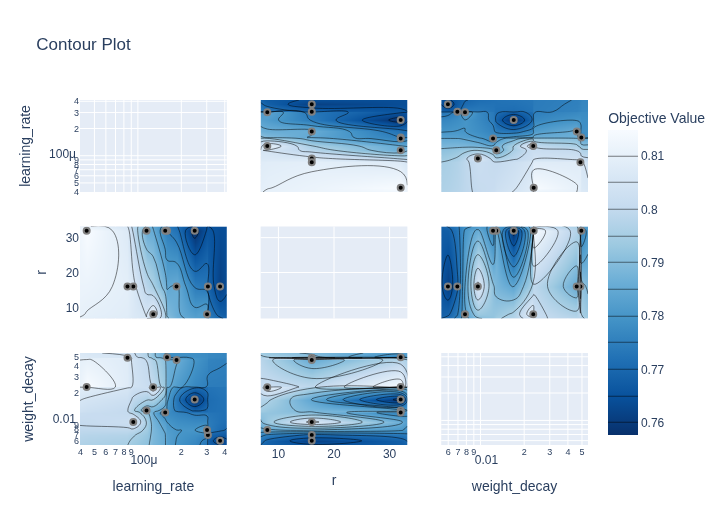
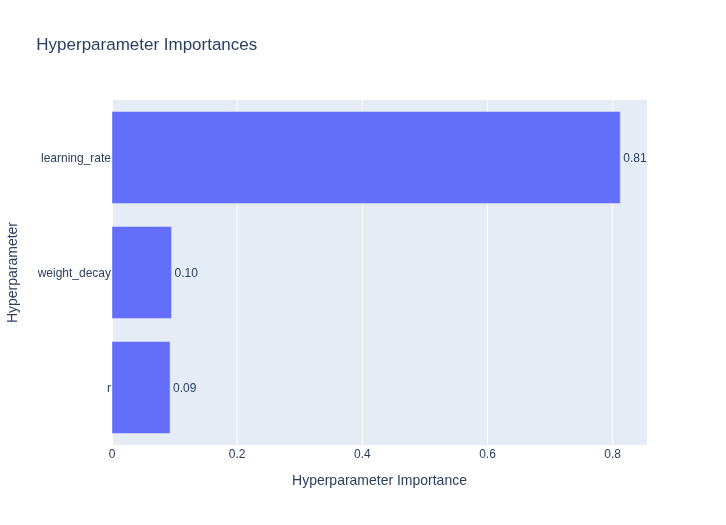

# Llama-3.2 Fine-Tuning Pipeline with Unsloth & Optuna
This project implements an end-to-end pipeline for fine-tuning the Llama-3.2-3B-Instruct model using the Unsloth library. It features a two-stage hyperparameter optimization search using Optuna before committing to a full training run with check-pointing, followed by automated evaluation and GGUF quantization.

## Technologies
- Models: unsloth/Llama-3.2-1B-Instruct-bnb-4bit, unsloth/Llama-3.2-3B-Instruct-bnb-4bit
- Training: Unsloth (with QLoRA)
- Optimization: Optuna
- Dataset: mlabonne/FineTome-100k (ShareGPT format)
- Evaluation: Sentence-Transformers (S-BERT), Rouge-Score
- Quantization: llama.cpp
- Hosting Platform: Hugging Face for both models and UI
- UI: Gradio python library
- Speech-to-Text: whisper small.en model
- Text-to-Speech: Coqui TTS tts_models/en/ljspeech/tacotron2-DDC model

## Workflow
### 1. Data Preparation

The pipeline loads the FineTome-100k dataset, standardizes it to the ShareGPT format, and applies the Llama-3.1 chat template. The data is split into three subsets:
  - Coarse Set (1k samples): For rapid hyperparameter exploration
  - Fine Set (3k samples): For validating top candidates
  - Full Set (50k samples): For the final training run

For more specific tasks (e.g. function calling), a different dataset can be used.

### 2. Hyperparameter Optimization (Optuna)
  - Stage 1: Coarse Search
    - Runs 12 trials on the small dataset (1k samples)
    - Explores a wide range of Learning Rates (4e-5 to 4e-4), LoRA Ranks (8, 16, 32), and Weight Decay (0.005 to 0.05)
  - Stage 2: Fine Search
    - Selects the top 4 performing configurations from Stage 1.
    - Re-runs them on a larger dataset (3k samples) to filter out noise and find the best configuration

### 3. Fine-Tuning Training

The best parameters found in Stage 2 (Learning Rate, Rank, Weight Decay) are injected into the final unsloth SFTTrainer
  - Config: QLoRA, Gradient Accumulation
  - Recovery: Includes checkpoint resumption logic to recover from Google Colab timeouts

### 4. Evaluation

The script generates responses for a set of modified test prompts from the dataset using both the Base Model and the Fine-Tuned Model. It calculates:
  - S-BERT Cosine Similarity: Measures how semantically similar the generated answer is to the ground truth
  - ROUGE-L Recall: Measures content overlap/coverage

With the answers and scores being saved, there is also a possibility for further Human Review or LLM-based Evaluation

### 5. Export & Quantization
- Merge: Merges LoRA adapters into the base model (16-bit)
- Build: Compiles llama.cpp from source
- Convert: Converts the merged model to GGUF F16
- Quantize: Compresses the model to Q4_K_M (4-bit quantization) for efficient execution

### 6. Inference

UI: https://huggingface.co/spaces/bakalis/iris \
App source code: https://huggingface.co/spaces/bakalis/iris/blob/main/app.py

- UI: Gradio Chatbot with Speech-to-Text and Text-to-Speech features.
- Context Window: 8192 tokens.
- Models: Supports both 1B and 3B fine-tuned models, interchangeably by a selector.
- Execution: Inference is executed on CPU.
- Interface: User can either enter a prompt using the textfield or record audio from his microphone.
- Output: By pressing r on the keyboard or the relevant button the last answer the chatbot has given is converted to audio and played.

